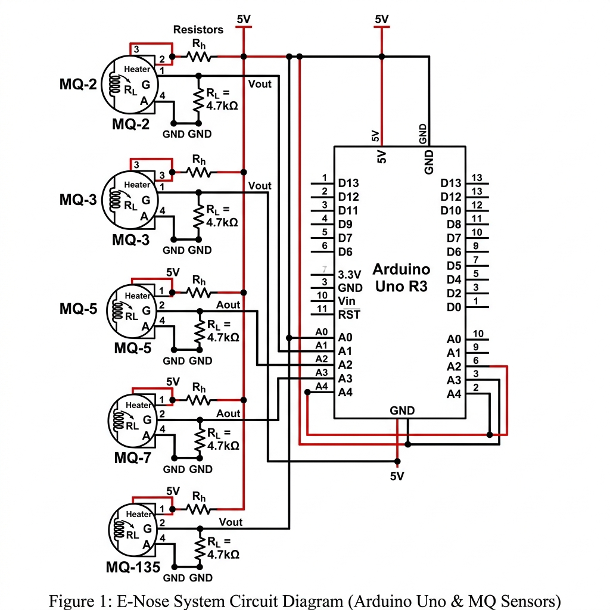

<div align="center">
  
  <h1>🌌 Smart E-Nose AI</h1>
  <p><strong>An Intelligent Olfactory System for Real-Time Atmospheric Safety</strong></p>

  <p>
    
    
    
    
  </p>
</div>

---

## 📖 Executive Summary
The **Smart E-Nose AI** is a cutting-edge IoT solution that bridges the gap between physical chemical sensing and machine intelligence. By fusing data from a 5-sensor array (MQ series), the system employs a **Random Forest Machine Learning model** to classify air quality with high precision, identifying hazards like gas leaks, smoke, and pollutants in real-time.

Designed for schools, offices, and industrial environments, it provides a high-performance visual dashboard that turns invisible atmospheric data into actionable safety insights.

---

## 🔥 Key Innovations

### 🧠 1. Machine Learning Core
Unlike threshold-based alarms, our system uses **Pattern Recognition**. It analyzes the "signature" of various gases across multiple sensors to distinguish between:
*   ✅ **Clean Air** (Baseline)
*   🔥 **Smoke/Fire**
*   ⚠️ **Gas Leaks** (LPG/Methane)
*   🍷 **Alcohol Vapors**
*   🌫️ **Polluted/Stale Air**

### 💻 2. Next-Gen Dashboard
Built with a sleek **Glassmorphism design**, the UI features:
*   **Reactive Background**: Particle simulations that turn red and chaotic during hazard detection.
*   **Live Analytics**: Time-series charts powered by Chart.js for trend tracking.
*   **Zero-Latency Bridge**: A multi-threaded Python bridge that syncs hardware data to the web in milliseconds.

### 🛠️ 3. Robust Architecture
*   **Hardware**: Arduino Uno + MQ-2, MQ-3, MQ-5, MQ-7, MQ-135 sensors.
*   **Backend**: Python Flask REST API with SQLite persistence.
*   **Simulator**: Built-in software-based sensor simulation for hardware-free development.

---

## 🔌 Hardware Configuration
The system uses a "Multi-Sensor Fusion" approach:

| Sensor | Target Detection | Primary Use Case |
| :--- | :--- | :--- |
| **MQ-2** | Smoke, LPG, Propane | Fire & Kitchen Safety |
| **MQ-3** | Alcohol, Ethanol | Lab & Workplace Monitoring |
| **MQ-5** | Natural Gas, LPG | Leak Detection |
| **MQ-7** | Carbon Monoxide | Indoor Air Quality |
| **MQ-135**| Benzene, Ammonia | Pollution & IAQ |

---

## 🚀 Quick Start (Local Setup)

### 1. Prerequisites
*   Python 3.10+
*   Browser (Chrome/Edge/Firefox)

### 2. Launching the System
We have simplified the deployment process. You don't need to configure any databases or accounts.

1.  **Run the Automator:**
    ```bash
    ./start.bat
    ```
    *This will automatically launch the Backend, Frontend, and Mock Simulator.*

2.  **Access the Interface:**
    Open [http://localhost:8000/dashboard.html](http://localhost:8000/dashboard.html) in your browser.

---

## 🛡️ Real-World Applications
*   **🏫 Smart Schools:** Monitoring chemistry labs and cafeterias for hazardous gas buildup.
*   **🏢 Modern Offices:** Ensuring optimal air quality (IAQ) for employee productivity and health.
*   **🏭 Industrial Safety:** Early warning systems for warehouses storing volatile organic compounds (VOCs).

---

## 🔮 Future Roadmap
- [ ] **Mobile App:** Cross-platform Flutter app for remote notifications.
- [ ] **Cloud Integration:** Data synchronization with AWS IoT Core.
- [x] **Predictive Alerts:** SMS/Email notifications via Twilio and SendGrid.
- [ ] **Advanced AI:** Transitioning to LSTM (Long Short-Term Memory) neural networks for temporal data analysis.

---

## 📝 License
Distributed under the MIT License. See `LICENSE` for more information.

---
<div align="center">
  <p>Built with ❤️ for a Safer Environment</p>
</div>
